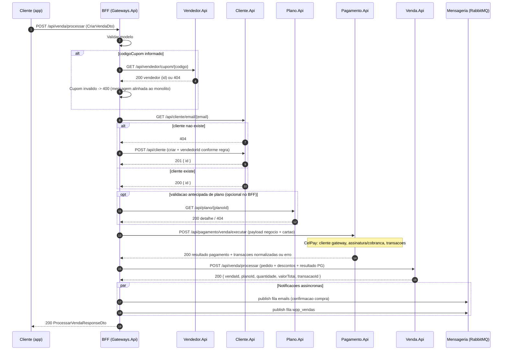
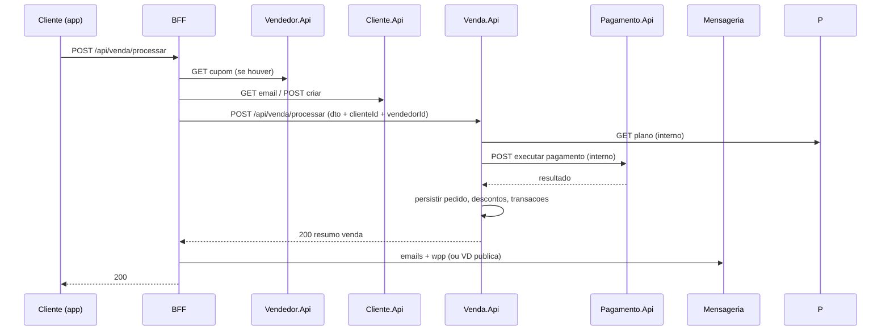

# Processar venda — orquestração (BFF) e contratos entre serviços

Documento de referência para alinhar implementação do fluxo equivalente ao `POST api/venda/processar` do monólito (`VendaController.ProcessarVenda` + `ProcessarVendaCommandHandler`).

**Fonte no monólito:** `projeto.moope.api` — DTOs `CriarVendaDto`, `ProcessarVendaResponseDto`, command `ProcessarVendaCommand`.

---

## 1. Diagrama de sequência — BFF orquestra todos os passos

Fluxo alvo quando o gateway (BFF) chama cada downstream em sequência. Inclui publicação assíncrona pós-sucesso (equivalente a e-mail + WhatsApp via RabbitMQ no monólito).



**Cabeçalhos recomendados:** `Authorization` (repassar aos serviços que exigirem), `X-Correlation-Id`, opcional `Idempotency-Key` no `POST` final ao Venda/Pagamento para evitar duplicidade em retry.

---

## 2. Diagrama alternativo — Venda.Api orquestra Pagamento (menos passos no BFF)

Reduz compensações no BFF: uma única chamada de domínio após cliente/cupom resolvidos.



---

## 3. Esboço OpenAPI por serviço

Trechos YAML para colar/evoluir em cada projeto (`swagger` / arquivo dedicado). Nomes e paths podem ser ajustados desde que o BFF e os consumidores combinem.

### 3.1 BFF — `Projeto.Moope.Gateways.Api`

```yaml
openapi: 3.0.3
info:
  title: Moope BFF - Vendas
  version: 0.1.0
paths:
  /api/venda/processar:
    post:
      summary: Processar venda (orquestrado)
      operationId: processarVenda
      security:
        - bearerAuth: []
      requestBody:
        required: true
        content:
          application/json:
            schema:
              $ref: '#/components/schemas/CriarVendaRequest'
      responses:
        '200':
          description: Venda processada
          content:
            application/json:
              schema:
                $ref: '#/components/schemas/ProcessarVendaResponse'
        '400':
          description: Validacao ou cupom invalido
        '502':
          description: Falha em servico downstream
components:
  securitySchemes:
    bearerAuth:
      type: http
      scheme: bearer
      bearerFormat: JWT
  schemas:
    CriarVendaRequest:
      type: object
      required:
        - nomeCliente
        - email
        - telefone
        - tipoPessoa
        - planoId
        - quantidade
        - nomeCartao
        - numeroCartao
        - cvv
        - dataValidade
      properties:
        nomeCliente: { type: string }
        email: { type: string, format: email }
        telefone: { type: string }
        tipoPessoa: { type: string, description: "enum TipoPessoa" }
        cpfCnpj: { type: string }
        vendedorId: { type: string, format: uuid, nullable: true }
        codigoCupom: { type: string, nullable: true }
        planoId: { type: string, format: uuid }
        quantidade: { type: integer, minimum: 1 }
        nomeCartao: { type: string }
        numeroCartao: { type: string, pattern: '^\d{13,19}$' }
        cvv: { type: string, pattern: '^\d{3,4}$' }
        dataValidade: { type: string, pattern: '^(0[1-9]|1[0-2])\/([0-9]{2})$' }
        estado: { type: string, nullable: true }
        descontos:
          type: array
          items: { type: string }
        comodatoToken: { type: string, nullable: true }
    ProcessarVendaResponse:
      type: object
      properties:
        planoId: { type: string, format: uuid }
        quantidade: { type: integer }
        valorTotal: { type: number, format: double }
        vendaId: { type: string, format: uuid }
        transacaoId: { type: string, format: uuid }
```

**Nota:** O monólito expõe `POST api/venda/processar` com `[AllowAnonymous]`. Definir se o BFF mantém anônimo para checkout público ou exige JWT; isso afeta apenas `security` e a regra de `vendedorId` no corpo.

---

### 3.2 Cliente.Api — pré-requisito para o BFF

```yaml
paths:
  /api/cliente/email/{email}:
    get:
      summary: Buscar cliente por email
      parameters:
        - name: email
          in: path
          required: true
          schema: { type: string }
      responses:
        '200':
          content:
            application/json:
              schema:
                type: object
                properties:
                  id: { type: string, format: uuid }
        '404': { description: Nao encontrado }
  /api/cliente:
    post:
      summary: Criar cliente
      requestBody:
        content:
          application/json:
            schema:
              type: object
              description: Alinhado a CreateClienteDto + vendedorId opcional
      responses:
        '201':
          content:
            application/json:
              schema:
                type: object
                properties:
                  id: { type: string, format: uuid }
```

---

### 3.3 Vendedor.Api — já próximo do necessário

```yaml
paths:
  /api/vendedor/cupom/{codigoCupom}:
    get:
      summary: Resolver vendedor por cupom
      parameters:
        - name: codigoCupom
          in: path
          required: true
          schema: { type: string }
      responses:
        '200':
          description: DTO com id do vendedor (ex. VendedorResponseDto)
        '404': { description: Cupom nao encontrado }
```

---

### 3.4 Plano.Api — leitura para validação / snapshot

```yaml
paths:
  /api/plano/{id}:
    get:
      summary: Detalhe do plano (valor, descricao, codigo, plataforma, status)
      parameters:
        - name: id
          in: path
          required: true
          schema: { type: string, format: uuid }
      responses:
        '200': { description: DetailPlanoDto ou equivalente }
        '404': { description: Plano nao encontrado }
```

---

### 3.5 Pagamento.Api — a implementar (`src/pagamento`)

Contrato sugerido: entrada com dados já validados pelo BFF ou Venda; saída normalizada para persistência de transações.

```yaml
paths:
  /api/pagamento/venda/executar:
    post:
      summary: Executar fluxo CelPay (cliente gateway + assinatura/cobranca)
      requestBody:
        content:
          application/json:
            schema:
              type: object
              required:
                - clienteInternoId
                - email
                - nomeCliente
                - documento
                - planoId
                - quantidade
                - cartao
              properties:
                clienteInternoId: { type: string, format: uuid }
                vendedorId: { type: string, format: uuid, nullable: true }
                email: { type: string }
                nomeCliente: { type: string }
                documento: { type: string, description: "CPF/CNPJ somente digitos" }
                planoId: { type: string, format: uuid }
                quantidade: { type: integer }
                estado: { type: string, nullable: true }
                descontos:
                  type: array
                  items: { type: string }
                tipoPessoa: { type: string }
                comodatoToken: { type: string, nullable: true }
                cartao:
                  type: object
                  properties:
                    nome: { type: string }
                    numero: { type: string }
                    cvv: { type: string }
                    validadeMmYy: { type: string }
      responses:
        '200':
          content:
            application/json:
              schema:
                type: object
                properties:
                  sucesso: { type: boolean }
                  mensagem: { type: string, nullable: true }
                  assinatura:
                    type: object
                    description: Status GalaxPay / CelPay normalizado
                  transacoes:
                    type: array
                    items:
                      type: object
                      properties:
                        valor: { type: number }
                        status: { type: string }
                        galaxPayId: { type: string, nullable: true }
                        dataPagamento: { type: string, format: date-time, nullable: true }
```

**Segurança:** não persistir dados completos de cartão; uso em trânsito TLS; considerar tokenização no futuro.

---

### 3.6 Venda.Api — novo serviço (pedido + descontos + transações)

```yaml
paths:
  /api/venda/processar:
    post:
      summary: Persistir venda apos pagamento (ou fluxo unificado se Venda chama Pagamento)
      parameters:
        - name: Idempotency-Key
          in: header
          required: false
          schema: { type: string }
      requestBody:
        content:
          application/json:
            schema:
              type: object
              required:
                - clienteId
                - planoId
                - quantidade
                - resultadoPagamento
              properties:
                clienteId: { type: string, format: uuid }
                vendedorId: { type: string, format: uuid, nullable: true }
                planoId: { type: string, format: uuid }
                quantidade: { type: integer }
                descontos:
                  type: array
                  items: { type: string }
                tipoPessoa: { type: string }
                estado: { type: string, nullable: true }
                resultadoPagamento:
                  $ref: '#/components/schemas/ResultadoPagamentoPersistencia'
      responses:
        '200':
          content:
            application/json:
              schema:
                $ref: '#/components/schemas/ProcessarVendaResponse'
components:
  schemas:
    ResultadoPagamentoPersistencia:
      type: object
      description: Mesmo formato agregado retornado por Pagamento.Api
    ProcessarVendaResponse:
      type: object
      properties:
        planoId: { type: string, format: uuid }
        quantidade: { type: integer }
        valorTotal: { type: number }
        vendaId: { type: string, format: uuid }
        transacaoId: { type: string, format: uuid }
```

Se **Venda.Api** encapsular a chamada a **Pagamento.Api**, o `requestBody` pode ser o mesmo `CriarVendaRequest` + `clienteId`/`vendedorId`, e a persistência ocorre no handler interno (espelho do `ProcessarVendaCommandHandler`).

---

## 4. Configuração BFF

Estender `DownstreamApis` (e `appsettings`) com base URLs, por exemplo:

- `Cliente`, `Plano`, `Pagamento`, `Venda` (além de `Vendedor`, `Auth`, `Endereco` já usados em cadastro de representante).

Contratos OpenAPI por serviço (arquivos YAML): pasta `docs/openapi/` (`bff-venda.yaml`, `cliente.yaml`, `pagamento.yaml`, `venda.yaml`, etc.).

Implementação inicial do BFF: `POST /api/bff/venda/processar` em `VendaBffController`, orquestrador `ProcessarVendaOrchestrator` em `Projeto.Moope.Gateways.Core`.

---

## 5. Checklist rápido

| Item | Responsável |
|------|-------------|
| Cupom → vendedorId | BFF + Vendedor.Api |
| Cliente por email / criar | Cliente.Api (reativar endpoints) |
| CelPay + regras taxa/plataforma | Pagamento.Api |
| Pedido, descontos, transações | Venda.Api |
| Filas `emails` / `wpp_vendas` | BFF ou Venda.Api + contrato de payload igual ao monólito |
| Idempotência e correlation id | BFF + serviços críticos |

---

*Última atualização: alinhado ao monólito Moope API (DTOs e fluxo de controller/handler).*
